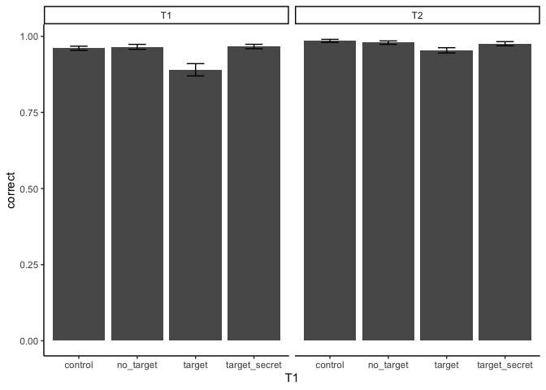
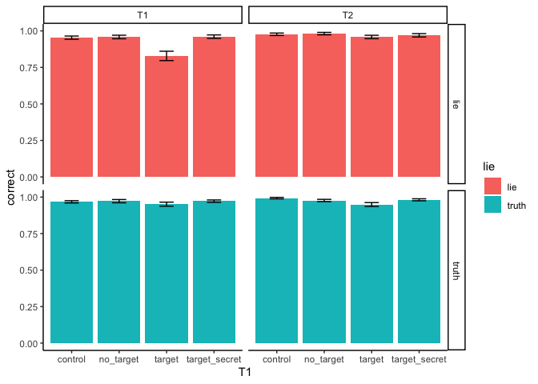

Behavioral analysis name\_hider\_experiment\_pilot1
================
Robbert van der Mijn
03/03/2022

# Description dataset

Load pre-processed data:

``` r
library(data.table)
library(ggplot2); theme_set(theme_classic())
load("20220309165755_36pps_cit_bch_dec21_targetBL.rdata")
```

# Demographics

``` r
demdat <- NULL
files <- Sys.glob("../data/*.csv")
for(f in files){
  d <- fread(f)
  demdat <- rbind(demdat, d, fill = T)
}

demdat[count_trial_sequence == 0, .N, by = sex]
```

    ##       sex  N
    ## 1:   Male  9
    ## 2: Female 27

``` r
demdat[count_trial_sequence == 0, .(age = mean(age), sd = sd(age))]
```

    ##         age       sd
    ## 1: 20.19444 1.348426

# Behavioral results

``` r
bdat <- dat[time == 0 & trial > 0] # one row per trial, remove practice trials
sum_bdat <- rbind(bdat[, .(correct = mean(T1_correct), target = "T1"), by = .(subject_nr, T1)],  bdat[, .(correct = mean(T2_correct), target = "T2"), by = .(subject_nr, T1)])

ggplot(sum_bdat[, .(correct = mean(correct), se = sd(correct)/sqrt(.N)), by = .(T1, target)], aes(x = T1, y = correct)) +
  geom_bar(stat = "identity") +
  geom_errorbar(aes(ymin = correct - se, ymax = correct + se), width = .3) +
  facet_wrap(~target)
```

<!-- -->

If participant would respond with a random button each trial, control,
no\_target and secret\_target would be 75% acc and target would be 25%.

What about liers and truthers?

``` r
sum_bdat_lie <- rbind(bdat[, .(correct = mean(T1_correct), target = "T1"), by = .(subject_nr, T1, lie)],  bdat[, .(correct = mean(T2_correct), target = "T2"), by = .(subject_nr, T1, lie)])

ggplot(sum_bdat_lie[, .(correct = mean(correct), se = sd(correct)/sqrt(.N)), by = .(lie, T1, target)], aes(x = T1, y = correct, fill = lie)) +
  geom_bar(stat = "identity") +
  geom_errorbar(aes(ymin = correct - se, ymax = correct + se), width = .3) +
  facet_grid(lie ~ target)
```

<!-- -->

# Conclusion

The task is relatively easy. Guessing a target correct based on chance
will yield 75% correct on “control”, “no target” and “secret target”
trials and 25% correct on “target” trials. It was easier for the “truth”
participants (their real name was the target) to spot the target that
for the “lie” participants (they chose a fake name as target).
