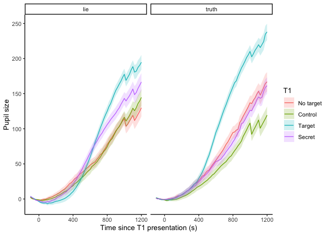
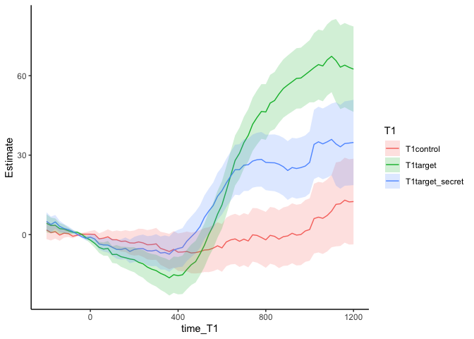

name\_hider\_experiment\_pilot1
================
Robbert van der Mijn
03/03/2022

# Description dataset

Load pre-processed data:

``` r
library(data.table)
library(ggplot2); theme_set(theme_classic())
library(lme4)
```

    ## Loading required package: Matrix

``` r
load("20220309165755_36pps_cit_bch_dec21_targetBL.rdata")
dat <- dat[subject_nr != 18]
dat$T1 <- relevel(dat$T1, "no_target")
dat <- dat[trial > 0]
```

# Mean pupil sizes

Quick check of mean trace for each participant (available at request).
One pp had irregular pupil pattern do to calibration trouble.

``` r
# dat_sum <- dat[, .(pupil = mean(pupil, na.rm = T), se = sd(pupil, na.rm = T)/sqrt(.N)), by = .(time_T1, T1, subject_nr)]
# ggplot(dat_sum, aes(x = time_T1, y = pupil, color = T1)) +
#   geom_line() +
#   facet_wrap(~subject_nr)
```

Separate traces for lie and truth participants

``` r
dat_gsum <- dat[, .(pupil = mean(pupil, na.rm = T), se = sd(pupil, na.rm = T)/sqrt(.N)), by = .(time_T1, T1, lie)]
ggplot(dat_gsum[time_T1 %between% c(-100, 1200)], aes(x = time_T1, y = pupil, color = T1)) +
  geom_line()  +
  geom_ribbon(aes(ymin = pupil - se, ymax = pupil + se, fill = T1), alpha = .2, color = NA) +
  facet_wrap(~lie) +
  scale_color_discrete(labels = c("No target", "Control", "Target", "Secret")) +
  scale_fill_discrete(labels = c("No target", "Control", "Target", "Secret")) +
  labs(x = "Time since T1 presentation (s)", y = "Pupil size")
```

<!-- -->

## LMER

linear mixed effects regression model on each time point. Use no\_target
as reference group. Plot coefficients:

``` r
coeffs <- NULL
for(t in seq(-200, 1200, by = 20)){
  m0 <- lmer(data = dat[time_T1 == t & lie == "lie"], pupil ~ T1 + (1|subject_nr))
  s <- summary(m0)
  coeffs <- rbind(coeffs, data.table(time_T1 = t, T1 = rownames(s$coefficients), s$coefficients))
}
setnames(coeffs, "Std. Error", "se")

ggplot(coeffs[T1 != "(Intercept)"], aes(x = time_T1, y = Estimate, color = T1)) +
  geom_line() +
  geom_ribbon(aes(ymin = Estimate - se, ymax = Estimate + se, fill = T1), alpha = .2, color = NA)
```

<!-- -->

Deviation from 0 means a difference from no\_target group.

# Logistic regression

To predict T1 condition based on pupil size, we fit logistic model in
which pupil size at each data point are used as predictor values.

*o**d**d**s* ∼ *p**u**p**i**l*<sub>*t*0</sub> \* *β*<sub>0</sub> + *p**u**p**i**l*<sub>*t*20</sub> \* *β*<sub>1</sub> + *p**u**p**i**l*<sub>*t*40</sub> \* *β*<sub>1</sub> + *p**u**p**i**l*<sub>*t*...</sub> \* *β*<sub>1</sub> + ... + *ϵ*
Odd are transformed into probabilities using:

$$
p = \\frac{1}{1 + e^{-odds}} 
$$

``` r
# Create dummy variables for each condition
dat[, no_target := ifelse(T1 == "no_target", 1, 0)]
dat[, control := ifelse(T1 == "control", 1, 0)]
dat[, target := ifelse(T1 == "target", 1, 0)]
dat[, target_secret := ifelse(T1 == "target_secret", 1, 0)]

# Create separate column for each timepoint in a new "wide" format table
dat_wide <- dcast(data = dat[lie == "lie"], subject_nr + trial + T1 + lie + target_secret ~ paste0("pupil_", time_T1), value.var = "pupil")

# Specify the regression model, add all 50 timepoints between 0 and 1s to predict if a trial is part of the secret condition or no target condition
formula <- paste0(c("target_secret ~", paste0(" pupil_", seq(0, 1000, by = 20), " +"), " (1|subject_nr)"), collapse = "")
subset <- dat_wide[T1 %in% c("target_secret", "no_target")]
m0a <- glmer(data = subset, as.formula(formula), family = "binomial")
```

    ## boundary (singular) fit: see ?isSingular

We use the model to made predictions for each trial

``` r
library(forcats)
predictions <- cbind(subset[, 1:5], prediction = predict(m0a, subset, type = "response"))
predictions[, choice := round(prediction)]

predictions[, type := ifelse(choice == target_secret, "correct", "incorrect")]

plotdat <- predictions[, .N, by = .(subject_nr, type)]

# mean number of correct, incorrect or inconclusive predictions
plotdat[, .(N = mean(N)), by = type]
```

    ##         type         N
    ## 1:   correct 26.944444
    ## 2:      <NA>  4.533333
    ## 3: incorrect 17.277778

So on average we predict about 27 trials correct, 17 incorrect and 5
inconclusive
